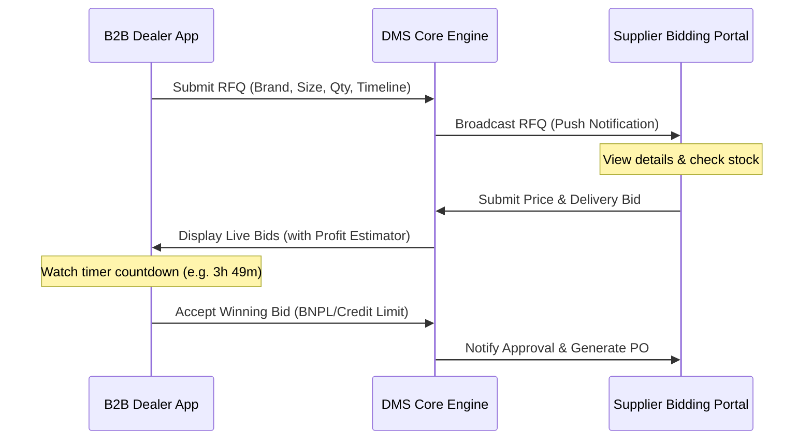

# 📚 Modern Tyre Dealer Management System (DMS) & Inventory Ecosystem PRD
## Product Requirements Document & UX Architecture Specification

### 1. Executive Summary
Tyre retail and B2B distribution operations are uniquely challenging compared to standard retail. Stock items are heavy, physically occupy massive volumes, have highly complex size/technical specifications, and degrade over time even when unused. In addition, dealers heavily rely on local distributors/suppliers for quick-turnaround orders when a customer walks in with a rare vehicle tyre request. 

This document outlines the product requirements, workflow architectures, and design tokens for an integrated, modern mobile-first DMS app that consolidates inventory tracking, real-time B2B quote bidding, mobile stocktake, and relationship manager workflows.

---

### 2. Specialized Tyre Taxonomy (Core Data Model)
A generic ERP inventory model is insufficient for tyre management. The database schema and front-end filters must categorize tyres using the following specialized parameters:

| Parameter | Type / Format | Description | Example / Usage |
| :--- | :--- | :--- | :--- |
| **Brand** | Enum / String | Manufacturer of the tyre. | `Apollo`, `Bridgestone`, `MRF`, `Michelin` |
| **Pattern / Model** | String | The specific tread design/model. | `Alnac 4GS`, `Ecopia EP150`, `Zapper` |
| **Section Width** | Integer (mm) | Width of the tyre tread from sidewall to sidewall. | `205`, `195`, `145` |
| **Aspect Ratio** | Integer (%) | Height of the sidewall as a percentage of the width. | `55`, `65`, `80` |
| **Rim Diameter** | Integer (Inches) | Diameter of the wheel rim. | `16`, `15`, `12` |
| **Speed Rating** | Char / Enum | Maximum safe speed for the tyre. | `V` (240 km/h), `H` (210 km/h) |
| **Load Index** | Integer | Maximum load carrying capacity. | `91` (615 kg), `88` (560 kg) |
| **Vehicle Category** | Enum | Segment classification. | `PCR` (Passenger Car Radial), `SUV` (Sports Utility), `TBR` (Truck/Bus Radial), `2W` (Two-Wheeler) |
| **Tyre Condition** | Enum | State of the tyre. | `New`, `Used`, `Retread` (Remolded tread) |
| **DOT Code** | String (WWYY) | Week and Year of manufacture (Safety limit: 5-6 years). | `1224` (12th week of 2024) |

---

### 3. B2B Quote & Bidding Portal (Dealer-Distributor Flow)
When a tyre dealer requires stock that is unavailable in-house, they trigger an RFQ (Request for Quote) flow. Rather than phone calls, the system implements a real-time B2B bidding marketplace.

#### Core Requirements:
1. **Live Countdown Timers**: Quote requests and bids feature active timers (e.g., `3h 49m left`). This creates urgency for suppliers to offer competitive pricing and ensures dealers secure inventory in time.
2. **Dealer Profit Margin Estimator**: As bids arrive, the dealer UI calculates and displays:
   $$\text{Profit Margin (\%)} = \left( \frac{\text{Projected Retail Price} - \text{Landed Cost Bid}}{\text{Projected Retail Price}} \right) \times 100$$
   This enables dealers to choose bids that maximize margin, not just the lowest cost.
3. **Split Payments & BNPL Integration**:
   - **Dealer BNPL**: Integrated line of credit allowing 30/60 day terms.
   - **Credit Note (CN) Deductions**: Automatically applies outstanding supplier credit notes to the purchase.
   - **Cash/Online Split**: Allows dealers to settle the order through multiple payment modes.

---

### 4. Specialized Inventory Portal & Stock Intake
1. **OCR-Based Invoice Upload**: To eliminate tedious manual entries, users snap a photo of a supplier's physical invoice. The OCR parser extracts the line items, tyre configurations, purchase price, and quantities, updating the inventory draft sheet for approval.
2. **Multi-Location Inventory Lookup**: Dealers can check cross-branch stock to check if a sister outlet has a particular tyre size before submitting a supplier RFQ.
3. **Par Level Automatic Reordering**: When fast-moving standard hatchback or motorcycle tyre SKUs drop below a designated safety stock limit, the system alerts the manager and populates a draft order.

---

### 5. Mobile-First Stocktake & Count Audit Workflow
Physical inventory reconciliation (stocktakes) in tyre warehouses faces low-light conditions and poor Wi-Fi.

#### The Workflow:
1. **Scheduled or Ad-hoc Audit Creation**: The manager assigns an audit ID (e.g., `AUD-1048`) filtered by location or brand.
2. **Double Scanning System**: Supports both high-speed camera scanning (scanning barcode/QR codes on tyre labels) and standard manual increments.
3. **Tactile Increment Steppers**: If label barcodes are dusty or damaged, large `+` and `-` buttons with haptic feedback allow rapid manual entry.
4. **Group-By Segment Layouts**: Allows counters to group their task lists by Brand, Location/Rack, or Tyre Size to match their physical walking path.
5. **Real-time Delta Calculation**: Displays expected stock vs. actual count immediately. Discrepancies are marked clearly:
   - **Shortage (e.g., `-2 Missing`)**: Colored in **Brand Red** (`#ED1D24`).
   - **Surplus (e.g., `+1 Surplus`)**: Highlighted in **Bidding Orange** (`#FF6B00`).
   - **Match (e.g., `✓ Clear`)**: Colored in **Success Green** (`#00B633`).
6. **Offline Sync Queue**: Offline mode stores counts locally. Once Wi-Fi is restored, the queue syncs to the server, managing conflicts via a "Last Write Wins" or "Manual Conflict Resolution" overlay.
7. **Double-Verification Reconciliation**: Discrepancies above a threshold (e.g. >2 tyres or >₹10k value) trigger a mandatory secondary audit check. A manager must approve or order a recount before adjusting the system ledger.

---

### 6. Design System & UI/UX Guidelines
A cohesive look-and-feel built for high-density readability in demanding retail environments.

#### Color Tokens:
*   **Brand Red (`#ED1D24`)**: Primary brand actions, shortage indicators, critical system alerts, and primary buttons.
*   **Success Green (`#00B633`)**: Successful bids, matched counts, total earnings, and payment completions.
*   **Bidding Orange (`#FF6B00`)**: Pending bids, live timers, discrepancy surplus, and quantity metrics.
*   **Primary Blue (`#0066FF` / `#2563EB`)**: Technical SKU labels, BNPL information sheets, and interactive links.
*   **Neutral Dark (`#000000`)**: Primary typography and headers.
*   **Slate Secondary (`#627085`)**: Captions, dates, placeholder search text, and secondary details.
*   **Page Background (`#F7FAFA`)**: Cool grey/white backdrop to contrast white content cards.

#### Typography (Standardizing):
*   **UI/Marketing Text**: *Poppins* (SemiBold for headers, Medium/Regular for descriptions).
*   **Data & System Text**: *Inter* / *SF Pro* (Regular/Medium/Bold for technical labels, SKU sizes, numbers, and timestamps).

#### Component Constraints:
*   **Corner Radii**: Systems badges (`4px`), buttons/inputs (`10px`), cards (`16px`), bottom drawers (`24px` top corners).
*   **Mobile Layout**: margins of `16px`, spacing between elements `8-12px`.
*   **Desktop Layout**: 280px sidebar, 1440px viewport grid.
*   **Micro-interactions**: Scale-on-press motions (`scale: 0.95` -> `1.0`) on quantity steppers, ticking countdown animations, and confetti/reward bursts for tier-up milestones.

---

### 7. Industry Benchmarking: Best-in-Class DMS Features
1. **MAM Software (Autopart)**: Great technical fitment cataloging (makes/models mapping to tyre dimensions), but legacy desktop UX.
2. **TyreSoft**: Native web app with automatic EU Tyre Label fetching (fuel rating, noise, wet grip), but lacks interactive distributor RFQ bidding.
3. **MaddenCo**: High-quality retread casing tracking and commercial fleet accounts billing, but dated mobile layouts.
4. **Best-in-Class Target**: A hybrid that brings the fitment database richness of MAM, the modern web UX of TyreSoft, the commercial retread depth of MaddenCo, and a real-time B2B RFQ bidding/stocktake platform.
