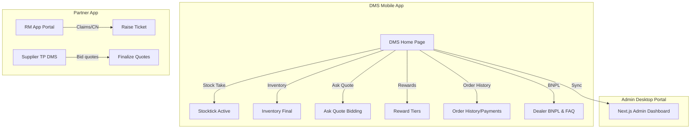

# DMS App Ecosystem Design System & Architecture Specification

This specification provides a consolidated, comprehensive analysis of the entire **Dealer Management System (DMS)** Figma design space. It covers the global design system tokens, typography scales, layout grids, and detailed analysis of all modules (Inventory, Stocktake, Bidding, Order History, Loyalty Rewards, BNPL, RM Portal, and Next.js Admin Dashboard).

---

## 🎨 Global Color System & Design Tokens

Across all modules, the ecosystem follows a consistent, high-contrast visual hierarchy. Bright functional accents highlight statuses, actions, and numeric metrics, while light page backgrounds establish depth.

### 1. Brand & Core Accents

| Color Token | Hex Code | Role in Design | Usage Examples |
| :--- | :--- | :--- | :--- |
| **Brand Red** | `#ED1D24` | Primary actions, branding, shortages | Primary buttons (Save, Submit, Pay Now), shortage alerts, partial status badges, and MAR date rings. |
| **Success Green** | `#00B633` / `#00B533` | Clear status, positive delta, active state | "✓ Clear" status tags, "✓" match icons, "Confirm Count" CTAs, "Total Amount" dashboard numbers. |
| **Bidding Orange** | `#FF6B00` | Warning states, active alerts, counts | "Quantity" metrics, live counters, alert icons. |
| **Primary Blue** | `#0066FF` / `#2563EB` | Info states, available items, finance links | "SKU" tags, "Dealer BNPL" headers, secondary action links. |
| **Loyalty Purple** | `#7A4DFF` | Category headers, brand markers | "Brands in Stock" cards, loyalty tiers. |
| **Tier Gold** | `#D4AF37` | Gold status level indicators | Gold tier headers, premium rewards. |
| **Tier Platinum** | `#F74F9E` | Platinum loyalty tier indicators | Platinum tier benefits, high-tier milestones. |

### 2. Neutral Grays & Backgrounds

*   **Dark Neutral:** `#000000` (Deep Black) for high-emphasis typography, headers, main screen titles, and primary action text.
*   **Slate Secondary:** `#627085` / `#717782` (Slate Gray) for captions, timestamps, placeholder search text, expected quantity figures, and RM app dealer names.
*   **Border Gray:** `#E5E8EB` / `#D9D9D9` for card borders, input borders, sheet separators, and horizontal dividers.
*   **Dark Selection:** `#121726` (Dark Navy Black) for active segment controls (e.g., "New" condition tab, active dashboard categories).
*   **Page Canvas background:** `#F7FAFA` / `#F3F4F6` (Cool Gray/White-Blue) for screen backdrops to offset card elements.

---

## ✍️ Typography & Hierarchical Scale

The Figma screens standardize on **Poppins** for modern layout content and **Inter** / **SF Pro** for native elements, icons, and language localization strings.

### Font Configurations

*   **Header Titles (20px - 24px Bold):** Used for outstanding financials (e.g., `₹ 75,000`), month headings (`MAR 23`), page title headings (`Audit AUD-1048`), and key numeric counts.
*   **Subheadings & Accent Labels (14px - 16px SemiBold/Medium):** Used for product names (e.g., `Apollo ALNAC 4GS 205/55/R16`), primary card titles, and section headers (e.g., "Popular Sizes", "More Actions").
*   **Body & Descriptions (11px - 13px Regular/Medium):** Used for input values, form descriptions, stepper labels, and auxiliary text.
*   **Metadata & Badges (8px - 10px Bold/SemiBold):** Used for item counts (e.g., `9 items`), timestamps, accordion labels, and discrepancy flags (`Last audited: Yesterday`).

---

## 📐 Layout & Spatial Rules

Stocktick and the DMS components use different responsive grid systems:
*   **Mobile Screens (401px - 412px width):** Built for standard Android/iOS handheld viewports. Card spacing is uniform at `16px` outer margins and `8px` - `12px` card gap alignments.
*   **Desktop Dashboards (1440px width):** Desktop layouts use a split sidebar navigation structure (`280px` wide) coupled with a multi-column data table layout (`720px` to `1160px` grids).
*   **Corner Radii Guidelines:**
    *   *System Badges:* `4px` - `6px`
    *   *Input Fields & Buttons:* `10px` - `12px`
    *   *Content Cards:* `16px`
    *   *Bottom Sheets / Action Drawers:* `20px` - `24px` top corners

---

## 📦 Page-by-Page Architectural Breakdown

The DMS design is organized into 11 functional canvases:

### 1. DMS Home Page & Shell (`DMS HOME PAGE`)
*   **Structure:** Multilingual support grids (English, Telugu, Kannada, Malayalam, Tamil) greeting users as `Hello, Tyre Czar`.
*   **Action Launchers:** Prominent grid-based launchers for **Buy Tyres**, **Manage Store**, **Pay**, and **Sell Tyres**.
*   **Visual Pattern:** Solid white navigation bars with circular floating action button overlays (`64x64px`).

### 2. Inventory Management (`inventory design final`)
*   **Dashboard:** Highlights current stock details, categories (Car, Bike, CV), and tyre conditions (New, Used, Retread).
*   **Actions:** Detailed add-item forms, invoice parser uploads, and advanced filter overlays.

### 3. Stocktake Module (`Stocktick`)
*   **Counting interface:** Handles count audits grouped by Brands or Vehicles.
*   **Actions:** Confirmations, steppers, error states for shortages (`-2 Missing`), discrepancy logs, and a `Success Screen` with a clean check badge overlay.

### 4. Buying & Bidding Quote System (`Ask Quote Dms`)
*   **Interface:** Live Order tracking dashboard, active request history, cash/online payment split, and price variant sheets.
*   **UX Pattern:** Active countdown labels showing quote validity times (e.g., `3h 49m left`).

### 5. Supplier Price Bidding (`Supplier_tp_dms`)
*   **Interface:** Bidding lists for incoming quote requests (e.g., Nylogrip Zapper tyres), quote rejections, final price inputs, and approved screens.
*   **Color coding:** Gray outline buttons for neutral actions, solid Brand Red for submissions.

### 6. Reward & Gamification Tiers (`Reward_screen`)
*   **Interface:** Earning history, tier levels (Silver, Gold, Platinum), and status milestone progress maps.
*   **Copy:** Clear reward values (e.g., `Silver Tier Benefits worth up to ₹30k`).

### 7. Dealer BNPL & Insurance (`BNPL_PAGE_DESIGN`)
*   **Interface:** FAQ drawers, interest charts, and credit limit indicators.
*   **Visual Pattern:** Accordion panels for common queries.

### 8. Order History & Dues (`DMS ORDER HISTORY`)
*   **Interface:** Total Outstanding statements (`TOTAL OUTSTANDING: ₹ 75,000`), scheduler widgets, custom payment inputs, and successful remittance screens.

### 9. Relationship Manager Portal (`RM APP`)
*   **Interface:** CN (Credit Note) management panels (`CN227372232400001`), Ticket Raise screens for warranty claims, B2B dealer directories.

### 10. Next.js Dashboard Desktop Portal (`Next js dashboard`)
*   **Interface:** Multi-card analytics showing metrics: `Requests - 25`, `Quote Sent - 8623`, `Dealer Price - 13`, `Final Quote - 56`.
*   **Visual Pattern:** Dual sidebar layout, horizontal table rows with hovering highlight cues.

---

## 🔍 Codebase vs. Figma Alignment Gap Analysis

1.  **Typographic Discrepancy:** The code currently uses `Plus Jakarta Sans`, but the entire Figma ecosystem (Mobile & Desktop) is designed around **Poppins** with **SF Pro** for Apple-specific styling.
2.  **Color System Standard:** The code defaults to tailwind generic colors (e.g., `bg-red-500` / `#ef4444`). Using the Figma-exact brand red `#ED1D24` will create a richer, deeper branded color profile.
3.  **Cross-Platform Emojis:** The Figma files use emojis (🥞, 🏷, 🏪) as illustrations inside cards. These render differently on Android, iOS, and Web. Replacing these with vector SVGs or customized static icon assets will standardize the interface.

---

## 🚀 Premium Visual & Interactive Suggestions

*   **Glassmorphism & Drawer Effects:** Use semi-transparent blur backdrops (`backdrop-blur-md bg-white/80`) behind bottom sheet drawers for a premium native look.
*   **Dynamic Countdown Counters:** Animate the ticking quote clocks (`3h 49m left`) on the Ask Quote modules with micro-transitions.
*   **Tactile Stepper Feel:** Implement smooth scale-on-press motions (`scale: 0.9` -> `scale: 1.0`) for steppers (`+` / `-` buttons) in the Add Tyre inventory drawers.
*   **Tier Status Confetti:** When displaying reward tier milestones, add subtle background animations to celebrate Gold/Platinum leveling.
